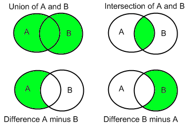
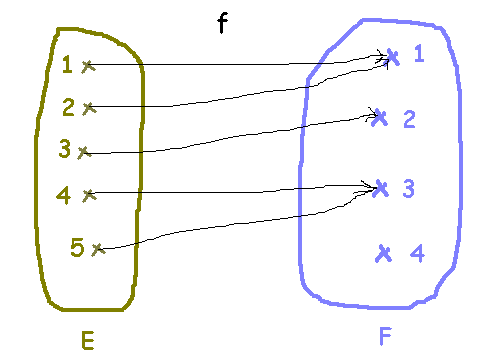

In this assignment, you will work with a functional representation of Sets based on the mathematical notion of characteristic functions. The goal is to gain practice with higher-order functions.

You will write your solutions by completing the stubs in the `FunSets.scala` file.

## Representation

We will work with Sets of integers.

As an example to motivate our representation, how would you represent the Set of all negative integers? You cannot list them all… one way would be so say: if you give me an integer, I can tell you whether it’s in the Set or not: for `3`, I say ‘no’; for `-1`, I say `yes`.

Mathematically, we call the function which takes an integer as argument and which returns a boolean indicating whether the given integer belongs to a FunSet, the _characteristic_ function of the FunSet. For example, we can characterize the FunSet of negative integers by the characteristic function `(x: Int) => x < 0`.

Therefore, we choose to represent a Set by its characterisitc function and define a type alias for this representation:

    type FunSet = Int => Boolean

Using this representation, we define a function that tests for the presence of a value in a FunSet:

    def contains(s: FunSet, elem: Int): Boolean = s(elem)

## Grading

Remember the rules :
- code compiles and passes all tests 
- functional programming (don't use variables, return statements or any imperative patterns)
- up to 5 bonus points if you write additional, relevant tests in the suite

singleElementSet, union, intersect, diff, filter : 2 points each

forall, exists : 3 points each

map : 4 points

## 2.1 Basic Functions on FunSets

Let’s start by implementing basic functions on FunSets.

1.  Define a function which creates a single element FunSet from one integer value: it represents the FunSet of the one given element. Its signature is as follows:

        def singleElementSet(elem: Int): FunSet

    Now that we have a way to create single element FunSets, we want to define a function that allow us to build bigger FunSets from smaller ones.

2.  Define the functions `union`, `intersect`, and `diff`, which takes two FunSets, and return, respectively, their union, intersection and differences. `diff(s, t)` returns a FunSet which contains all the elements of the FunSet `s` that are not in the FunSet `t`. These functions have the following signatures:

        def union(s: FunSet, t: FunSet): FunSet
        def intersect(s: FunSet, t: FunSet): FunSet
        def diff(s: FunSet, t: FunSet): FunSet.

        
        
3.  Define the function `filter` which selects only the elements of a FunSet that are accepted by a given predicate `p`. The filtered elements are returned as a new FunSet. The signature of `filter` is as follows:

        def filter(s: FunSet, p: Int => Boolean): FunSet

## 2.2 Queries and Transformations on FunSets

In this part, we are interested in functions used to make requests on elements of a FunSet. The first function tests whether a given predicate is true for all elements of the FunSet. This `forall` function has the following signature:

    def forall(s: FunSet, p: Int => Boolean): Boolean

Note that there is no direct way to find which elements are in a FunSet. `contains` only allows to know whether a given element is included. Thus, if we wish to do something to all elements of a FunSet, then we have to iterate over all integers, testing each time whether it is included in the FunSet, and if so, to do something with it. Here, we consider that an integer `x` has the property `-1000 <= x <= 1000` in order to limit the search space.

1.  Implement `forall` using linear recursion. For this, use a helper function nested in `forall`. Its structure is as follows (replace the `???`):

        def forall(s: FunSet, p: Int => Boolean): Boolean = {
         def iter(a: Int): Boolean = {
           if (???) ???
           else if (???) ???
           else iter(???)
         }
         iter(???)

    }

2.  Using `forall`, implement a function `exists` which tests whether a FunSet contains at least one element for which the given predicate is true. Note that the functions `forall` and `exists` behave like the universal and existential quantifiers of first-order logic.

        def exists(s: FunSet, p: Int => Boolean): Boolean

*Hint* ([wikipedia](https://en.wikipedia.org/wiki/Existential_quantification#Negation)): the negation of a propositional function's existential quantification is a universal quantification of that propositional function's negation; symbolically,
: ¬∃x∈X, P(x) ↔ ∀x∈X, ¬P(x)

3.  Finally, write a function `map` which transforms a given FunSet into another one by applying to each of its elements the given function. `map` has the following signature:

        def map(s: FunSet, f: Int => Int): FunSet

   

## Extra Hints

*   FunSets are represented as functions. Think about what it _means_ for an element to belong to a FunSet, in terms of function evaluation. For example, how do you represent a FunSet that contains all numbers between 1 and 100?
*   Most of the solutions for this assignment can be written as one-liners. If you have more, you probably need to rethink your solution. In other words, this assignment needs more thinking (whiteboard, pen and paper) than coding ;-).
*   If you are having some trouble with terminology, have a look at the [glossary](http://docs.scala-lang.org/glossary/).
